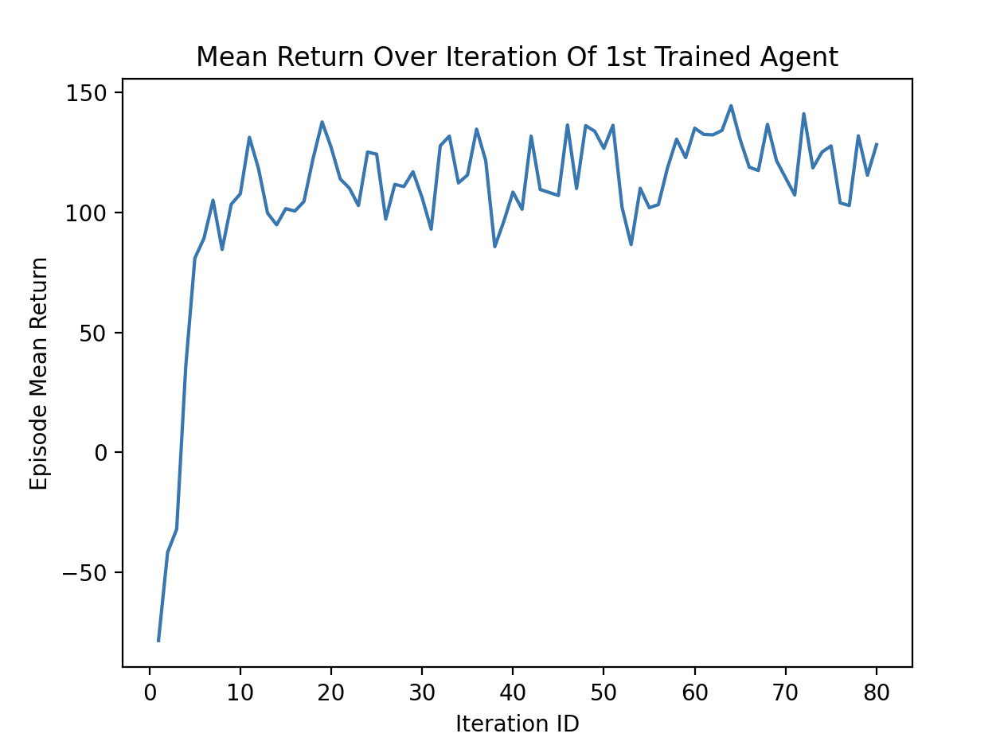
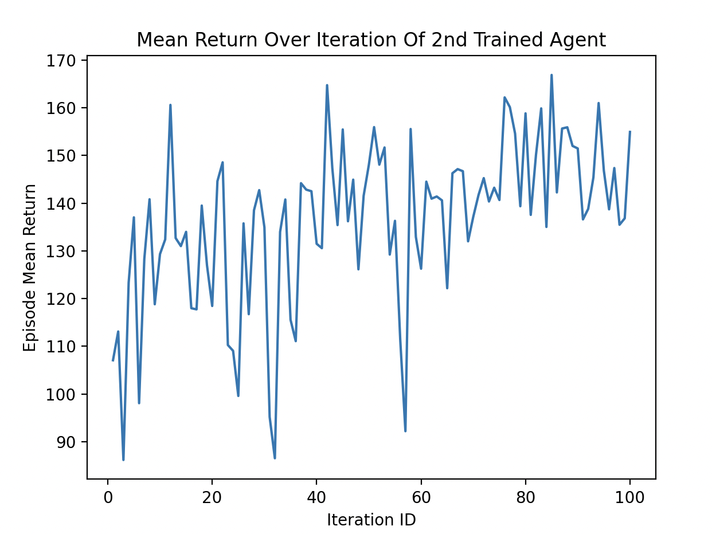
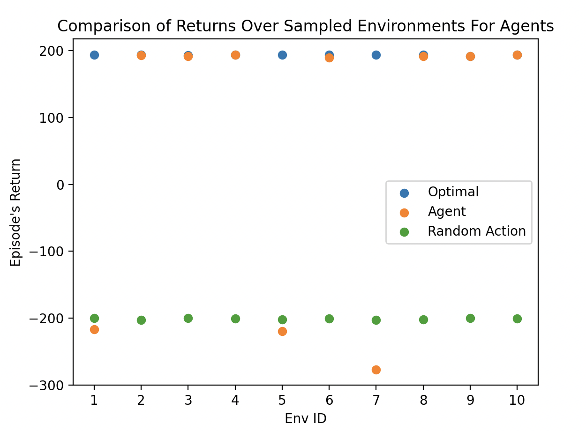

# Self-driving Car On Limited Segment
## Project Summary
<!-- Around 200 Words -->
<!-- Cover (1) What problem you are solving, (2) Who will use this RL module and be happy with the learning, and (3) a brief description of the results -->

We investigate the problem of a self-driving car moving down a segment of a highway. The path from point A to point B on which a car moves in real world can be broken down to a series of no-turning segments with a starting position and a designated lane on which the agent has to be when the the agent reaches the end of a particular segment; e.g. if you drive forward on a road and need to turn left 2 more times to reach the road of your destination then there're 3 segments on that path where at the end of the first 2 segments the agent needs to be on the left lane for turning. In our problem, we investigate on the segment level how an agent can optimally reach the destination.

People who would be interested in this RL module are those who want to see a simplification of the self-driving car problem being solved by a Deep Q Network.

***Short Result***: We trained a DQN to perform well on the segment problem using a simplified segment scenario where there are some stationary cars and some other moving cars that the agent has to avoid crashing into. The trained algorithm is not perfect since we have limited time to train the agent but it can be improved with more training.

## State Space
<!-- See the Cart Pole Env example https://gymnasium.farama.org/environments/classic_control/cart_pole/ -->
We assume full observability of the state space by the agent. Visually, a state looks like this (where the 1st number in each pair describes the car and the 2nd describes its next-step action):

        x 00 00 00 x 
    ++++x 00 00 00 x++++    <- Goal Line  
        x 00 00 00 x    
        x 00 10 10 x    
        x 00 00 00 x    
        x 00 00 00 x    
        x 10 10 00 x    
        x 00 00 00 x    
    ----x 00 20 11 x----    <- Start Line
        x 00 00 00 x 

The State Space is reprresented by a dictionary with the following entries:

| Dict_Key   | Description                                         | Data Structure | Min | Max |
|------------|-----------------------------------------------------|----------------|-----|-----|
| car_ids    | Information about the existence and type of cars (non-agent or agent)        | A flattened np array of shape (30,) | 0 | 2 |
| car_actions| Information about the action to be taken by cars in the next time step        |A flattened np array of shape (30,) | 0 | 7 |
| goal_info  | Information about the goal | A np array of shape (2,)| 0 | [7, 2] |

car_ids value meaning:

| Value | Description                                         | 
|-----|-----------------------------------------------------|
| 0   | No car                              | 
| 1   | Non-agent car      | 
| 2   | Agent car | 

car_actions value meaning will be the same as in [Action Space](#action-space).
- *Note*: action value for the agent car in an observation will always be 0 since the agent will choose an action.

goal_info has 2 entries: 

| ID  | Description                                          |  Min | Max |
|-----|------------------------------------------------------|------|-----|
| 1   | Vertical distance between the agent and the goal line| 0 | 7 | 
| 2   | The lane ID at the goal line agent needs to land on to get maximum reward, where 0 means left lane, 1 means middle, and 2 means right| 0 | 2 |

## Action Space
<!-- See the Cart Pole Env example https://gymnasium.farama.org/environments/classic_control/cart_pole/ -->
Action space for the agent car is a Discreet space with 8 possible values:

| Value | Description                                         | 
|-----|-----------------------------------------------------|
| 0 | stay still |
|1  | go straight 1 unit |
|2  | go up 1 unit then left 1 unit |
|3  | go up 1 unit then right 1 unit |
|4  | go left 1 unit |
|5  | go right 1 unit |
|6  | go left 1 unit and then up 1 unit |
|7  | go right 1 unit and then up 1 unit |

## Rewards
<!-- See the Cart Pole Env example https://gymnasium.farama.org/environments/classic_control/cart_pole/ -->

- Reward is -200 if agent car crashes to a wall or to another car.
- Reward is +200 if agent car lands on the Goal Line at the correct lane.
- Reward is -1 otherwise.

## Termination and Truncation

- An episode terminates when agent car crashes or when agent car lands on the Goal Line.
- Truncation occurs when number of steps in an episode reaches 150 (can be changed).

## Environment

- Environment is located in file `./intro-custom-env-and-ray/env_creation2.py`.
- Action parsing priority in the `env.step()` prioritizes parsing from top to bottom where at each row, action of lower value will have higher priority (where action values are defined in [Action Space](#action-space)).
- Some environment variables (like truncation episode length, AI random action probability...) can be modified in `env.__init__()` or `env.reset()`.
- The starting state (and variability of its part) can be modified in `env.reset()`.
- Non-agent AI cars' actions are driven by `dumb_AI` method whose behavior is documented in the code. The non-agent cars are 'smart' cars in the sense that if they are gonna crash, the system will ignore its action instead, i.e AI cars can never crash.
- When agent crashes, the returned observation will be freezed at the moment of the crash.

## RL Algorithm 

We use Deep Q Network (DQN). It is an off-policy action-value-estimation method.

We are going to use the ray rllib implementation with default configuration.

## Starting State [if applicable]
<!-- See the Cart Pole Env example https://gymnasium.farama.org/environments/classic_control/cart_pole/ -->

The successfully trained agent's starting state that has the most variability factors is one where there are:
1. Goal_lane variation (goal_lane randomly chosen for each episode).
2. Two moving non-agent cars with random initial position around agent (with deterministic action).
3. Random agent intial position (which is located on Start Line only).
4. Fixed locations of 4 stationary cars.

An example of a starting state is:

        x 00 00 00 x 
    ++++x 00 00 00 x++++    <- Goal Line  
        x 00 00 00 x    
        x 00 10 10 x    
        x 00 00 00 x    
        x 00 00 00 x    
        x 10 10 00 x    
        x 00 00 00 x    
    ----x 20 00 11 x----    <- Start Line
        x 11 00 00 x 

## Results

- We trained the agent on the environment with starting state described as above. It is shown that the DQN agent is robust in learning in a dynamic environment, as long as sufficient state information are given (to satisfy Markov property). We trained the agent first for 80 iterations, starting from another trained agent that is already robust in an environment similar to one described in the Starting State section except with only one non-agent moving car (which explains why agent obtains good mean returns so fast as shown in the graph), then another time for 100 iterations starting from the 80-iteration-trained algorithm.
- To see a demonstration of the performance of the agent, run `intro-custom-env-and-ray/testcar.py`.
- The complete log of training history as well as associated algorithm files are recorded in `./train_log.txt`.
- Although beyond the scope of the best trained agent studied here, we surmise that the agent will also learn successfully when we introduce more variability like AI cars' random actions, random positions on stationary cars on row 3 and 6, using more (and variable number of) non-agent cars, expanding map size....

Plot of mean returns over iteration for the first 80-iteration agent:

Plot of mean returns over iteration for the later 100-iteration agent:

Plot of optimal, 2nd agent, random-action returns over 10 random starting environment (all 3 agents are tested on the same fixed evironment ):

